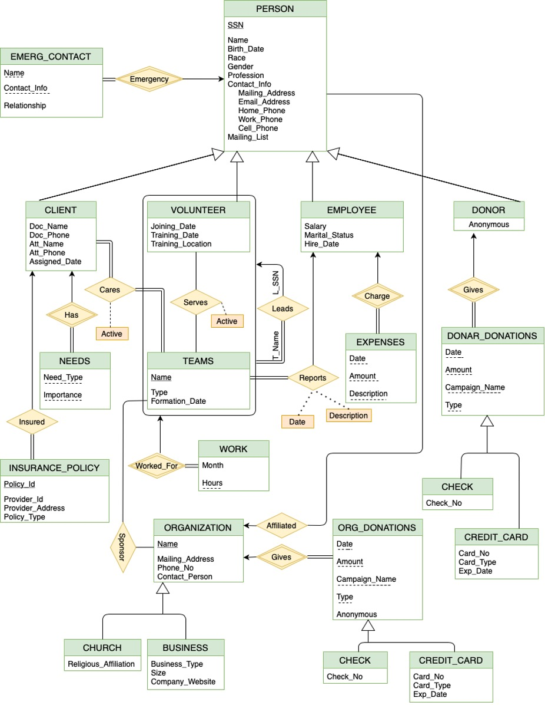

# A PATIENT ASSISTANT NETWORK DATABASE SYSTEM

#### Author: Harikiran Madishetti

---

## About

The Patient Assistance Network (PAN) is a non-profit organization that provides support and care for patients. PAN needs to implement a database system to keep track of the personnel necessary to support the organization. In this project, your task will be to design and implement this database system. The information that needs to be stored in the database is described in the next section.

## System Requirements

All the details required to build a database system is present in [Design_Requirements.md](Design_Requirements.md)

## Entity-Relationship Diagram

## Database Relational Schema

#### Entity Sets:

1. Person (SSN, Birth_Date, Race, Gender, Profession, Mailing_Address, Email_Address,
   Home_phone, Cell_Phone, Work_Phone, Mailing_List, Org_Name)
2. Client (SSN, Doc_Name, Doc_Phone, Att_Name, Att_Phone, Assigned_Date)
3. Volunteer (SSN, Joining_Date, Training_Date, Training_Location)
4. Employee (SSN, Salary, Marital_Status, Hire_Date)
5. Donor (SSN, Anonymous)
6. Emerg_Contact (SSN, Name, Contact_Info, Relationship)
7. Insurance_policy (Policy_Id, SSN, Provider_Id, Provider_Address, Policy_Type)
8. Needs (SSN, Need_Type, Importance)
9. Teams (Name, Type, Formation_Date)
10. Expenses (SSN, Date, Amount, Description)
11. Donor_Donations (SSN, Date, Amount, Campaign_Name, Type)
12. Donor_Donations_Check (SSN, Date, Amount, Campaign_Name, Type, Check_No)
13. Donor_Donations_Card (SSN, Date, Amount, Campaign_Name, Type, Card_No, Card_Type,
    Exp_Date)
14. Organization (Name, Mailing_Address, Phone_No, Contact_Person)
15. Church (Name, Religious_Affiliation)
16. Business (Name, Business_Type, Size, Company_Website)
17. Org_Donations (Name, Date, Amount, Campaign_Name, Type, Anonymous)
18. Org_Donations_Check (Name, Date, Amount, Campaign_Name, Type, Check_No)
19. Org_Donations_Card (Name, Date, Amount, Campaign_Name, Type, Card_No, Card_Type,
    Exp_Date)

#### Relationships:

1. Cares (SSN, Name, Active)
2. Serves (SSN, Name)
3. Leader (Name, SSN)
4. Work (SSN, Name, Months, Hours)
5. Sponsor (Team_Name, Org_Name)
6. Reports (Name, SSN, Date, Description)

## Data Dictionary

The data dictionary for PAN Database System can be found [here.](Data_Dictionary.pdf)

## File Organization

The File Organization of the tables defined in relational schema can be found [here.](Storage_Structure.pdf)

## DB Table Creation

The SQL statements to be created in the database can be found [here.](Create_Tables.sql)

## Insert Data and Perform Tasks

The SQL statements to insert the data and the queries which can be used to do all the tasks as mentioned in [Design_Requirements.md](Design_Requirements.md) can be found [here.](Tasks.sql)
