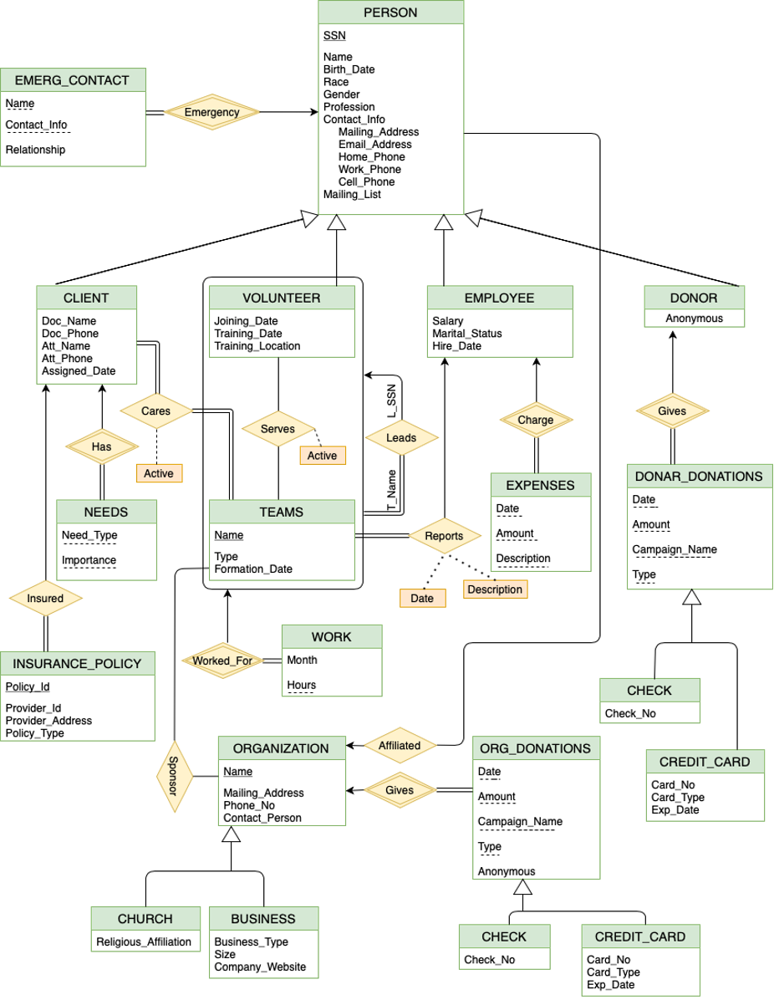

# A PATIENT ASSISTANT NETWORK DATABASE SYSTEM

#### Author: Harikiran Madishetti

---

## About

The Patient Assistance Network (PAN) is a non-profit organization that provides support and care for patients. PAN needs to implement a database system to keep track of the personnel necessary to support the organization. In this project, your task will be to design and implement this database system. The information that needs to be stored in the database is described in the next section.

## System Requirements

All the details required to build a database system is present in [Design_Requirements.md](Design_Requirements.md)

## Entity-Relationship Diagram

